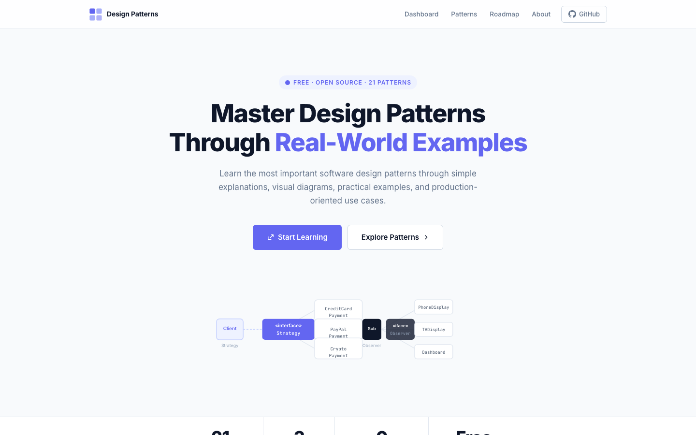
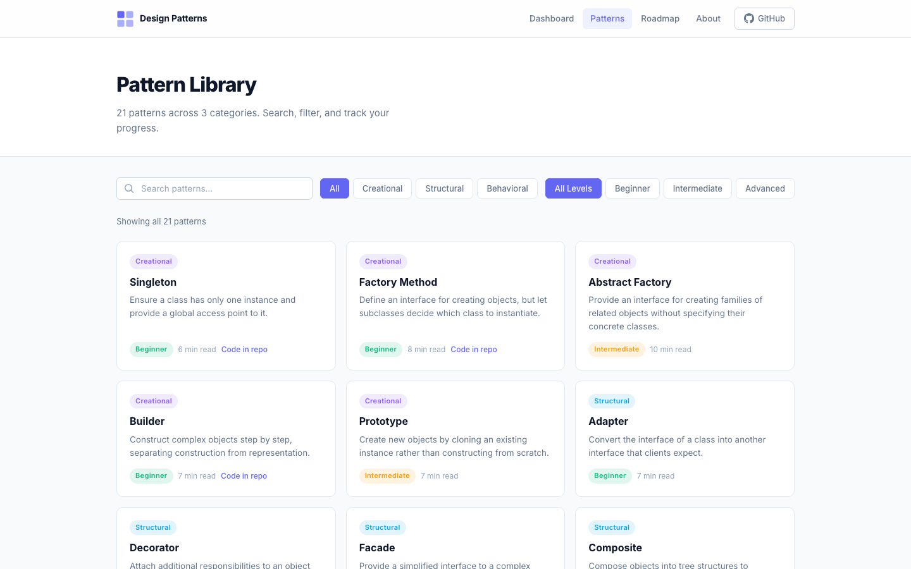
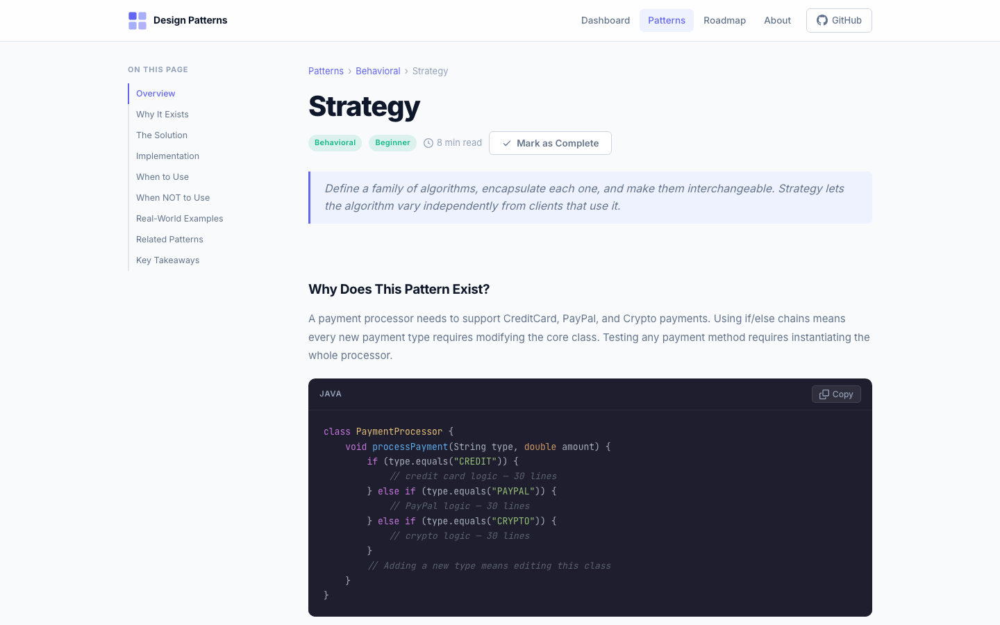
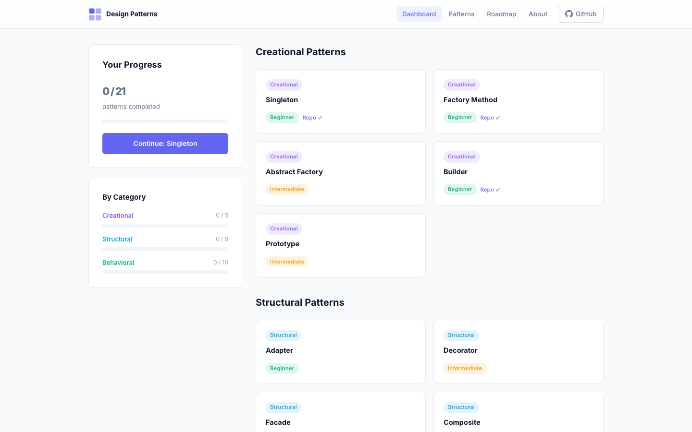
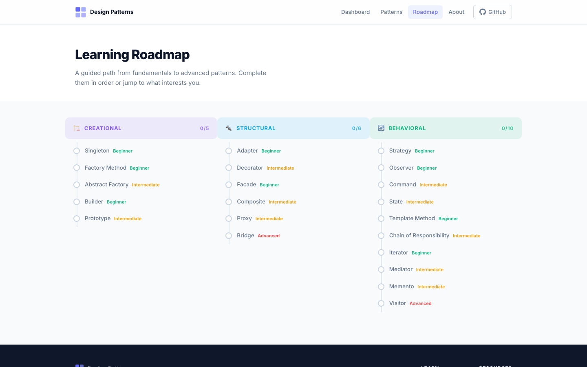
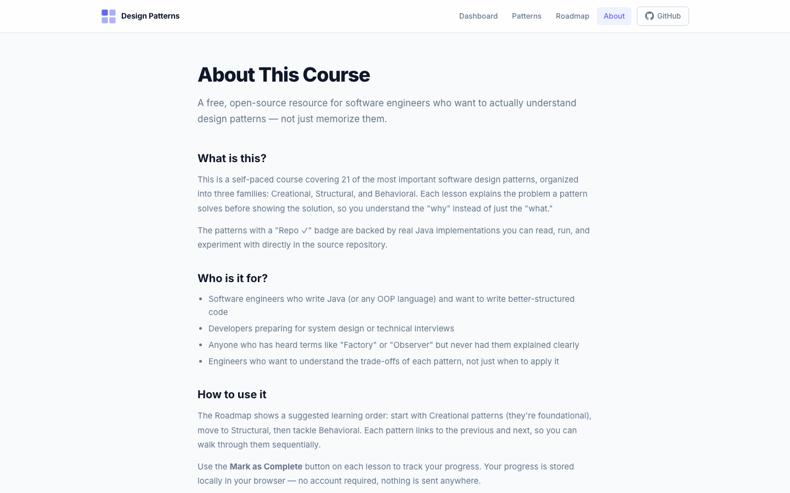

# Design Patterns — From Fundamentals to Production

A free, open-source course website for learning software design patterns through real Java implementations, visual diagrams, and production-oriented examples.

🌐 **Live site:** [sprintooo.github.io/designPattern](https://sprintooo.github.io/designPattern/)

---

## Screenshots

### Landing Page


### Pattern Library


### Pattern Detail (Strategy)


### Dashboard


### Learning Roadmap


### About


---

## What's Inside

**21 design patterns** across 3 categories — each with a full lesson:

| Category | Patterns |
|---|---|
| **Creational** | Singleton, Factory Method, Abstract Factory, Builder, Prototype |
| **Structural** | Adapter, Decorator, Facade, Composite, Proxy, Bridge |
| **Behavioral** | Strategy, Observer, Command, State, Template Method, Chain of Responsibility, Iterator, Mediator, Memento, Visitor |

Each lesson covers:
- **Why the pattern exists** — the problem it solves, shown with bad code
- **The solution** — ASCII structure diagram
- **Java implementation** — syntax-highlighted, copyable code block
- **When to use / avoid** — checklist with trade-offs
- **Real-world examples** — where you've already seen it
- **Related patterns** — clickable navigation
- **Key takeaways** — 3–5 concise points

---

## Features

- **Search & filter** — find patterns by name, category, or difficulty
- **Progress tracking** — mark patterns complete, stored in `localStorage`
- **Learning roadmap** — visual path from beginner to advanced
- **Dashboard** — per-category progress breakdown
- **Code in repo** — 4 patterns (Strategy, Factory Method, Singleton, Builder) link directly to the Java source
- **Responsive** — works on desktop, tablet, and mobile
- **No backend** — fully static, works on GitHub Pages

---

## Project Structure

```
├── index.html          # Landing page
├── patterns.html       # Searchable pattern library
├── pattern.html        # Individual lesson (loads via ?id=strategy)
├── dashboard.html      # Progress dashboard
├── roadmap.html        # Visual learning roadmap
├── about.html          # About page
├── style.css           # Global design system (light theme)
├── js/
│   ├── data.js         # All 21 pattern definitions + content
│   ├── app.js          # Progress tracker, code block renderer, utilities
│   ├── nav.js          # Shared navbar + footer injectors
│   ├── pattern.js      # Individual lesson page renderer
│   ├── dashboard.js    # Dashboard logic
│   └── roadmap.js      # Roadmap renderer
├── screenshots/        # Site screenshots
└── src/main/java/      # Java source implementations
    └── org/patidar/
        ├── behaviorPattern/strategyPattern/payment/
        ├── creationalPattern/builder/sample/
        ├── creationalPattern/factoryMethod/notificationSystem/
        ├── creationalPattern/factoryMethod/pizzaStore/
        └── creationalPattern/singleton/sample/
```

---

## Java Implementations

Patterns with working Java source code in the repository:

### Strategy Pattern
`src/main/java/org/patidar/behaviorPattern/strategyPattern/payment/`

A payment processor that supports CreditCard, PayPal, and Crypto payments — each as a swappable strategy.

### Factory Method
`src/main/java/org/patidar/creationalPattern/factoryMethod/`

Two examples: a notification system (Email, SMS, Push) and a pizza store, both using factory method to decouple creation.

### Singleton
`src/main/java/org/patidar/creationalPattern/singleton/sample/`

Lazy, thread-safe, and double-checked locking implementations side by side.

### Builder
`src/main/java/org/patidar/creationalPattern/builder/sample/`

Fluent builder for constructing complex objects step by step.

---

## Running Locally

No build step needed — just serve the files:

```bash
# Python
python3 -m http.server 8080

# Node
npx serve .
```

Then open `http://localhost:8080` in your browser.

---

## Tech Stack

| | |
|---|---|
| **Language** | Java (pattern implementations) |
| **Frontend** | HTML + CSS + Vanilla JS (no framework) |
| **Syntax highlighting** | [highlight.js](https://highlightjs.org/) via CDN |
| **Fonts** | Inter (UI) + JetBrains Mono (code) via Google Fonts |
| **Hosting** | GitHub Pages (static, no backend) |

---

## GitHub Pages Setup

1. Go to **Settings → Pages**
2. Set source to **`main` branch**, `/ (root)` folder
3. Save — the site will be live at `https://<your-username>.github.io/designPattern/`

---

## License

Content: [CC BY 4.0](https://creativecommons.org/licenses/by/4.0/) · Code: [MIT](https://opensource.org/licenses/MIT)
